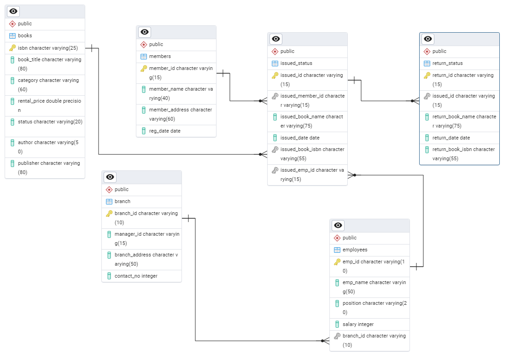

# Library Management System using SQL 

## Project Overview

**Project Title**: Library Management System  
**Level**: Intermediate  
**Database**: `sql_project_2`

This project demonstrates the implementation of a Library Management System using SQL. It includes creating and managing tables, performing CRUD operations, and executing advanced SQL queries. The goal is to showcase skills in database design, manipulation, and querying.

## Objectives

1. **Set up the Library Management System Database**: Create and populate the database with tables for branches, employees, members, books, issued status, and return status.
2. **CRUD Operations**: Perform Create, Read, Update, and Delete operations on the data.
3. **CTAS (Create Table As Select)**: Utilize CTAS to create new tables based on query results.
4. **Advanced SQL Queries**: Develop complex queries to analyze and retrieve specific data.

## Project Structure

### 1. Database Setup


- **Database Creation**: Created a database named `sql_project_2`.
- **Table Creation**: Created tables for branches, employees, members, books, issued status, and return status. Each table includes relevant columns and relationships.

```sql
CREATE DATABASE sql_project_2 ;

-- step 1 create Branch Table
DROP TABLE IF EXISTS branch;
CREATE TABLE branch(
	branch_id VARCHAR(10) PRIMARY KEY,
	manager_id VARCHAR(15), --FK
	branch_address VARCHAR(50),
	contact_no INT
);

ALTER TABLE branch
ALTER COLUMN contact_no TYPE VARCHAR(25);


-- step 2 create Employee table
DROP TABLE IF EXISTS employees;
CREATE TABLE employees(
            emp_id VARCHAR(10) PRIMARY KEY,
            emp_name VARCHAR(50),
            position VARCHAR(20),
            salary INT,
            branch_id VARCHAR(10) --FK
);


-- Step 3 Create Book Table
DROP TABLE IF EXISTS books;
CREATE TABLE books(
            isbn VARCHAR(25) PRIMARY KEY,
            book_title VARCHAR(80),
            category VARCHAR(60),
            rental_price FLOAT,
            status VARCHAR(20),
            author VARCHAR(50),
            publisher VARCHAR(80)
);


-- Step 4 create table members
DROP TABLE IF EXISTS members;
CREATE TABLE members(
            member_id VARCHAR(15) PRIMARY KEY,
            member_name VARCHAR(40),
            member_address VARCHAR(60),
            reg_date DATE
);


-- STEP 5 CREATE ISSUE_STATUS TABLE
DROP TABLE IF EXISTS issued_status;
CREATE TABLE issued_status(
            issued_id VARCHAR(15) PRIMARY KEY,
            issued_member_id VARCHAR(15), --FK
            issued_book_name VARCHAR(75),
            issued_date DATE,
            issued_book_isbn VARCHAR(55), --FK
            issued_emp_id VARCHAR(15) --FK
);


-- STEP 6 CREATE RETURN_STATUS TABLE
-- DROP TABLE return_status ;
CREATE TABLE return_status(
    return_id VARCHAR(15) PRIMARY KEY,
    issued_id VARCHAR(15), --FK
    return_book_name VARCHAR(75),
    return_date DATE, 
    return_book_isbn VARCHAR(55)
);

```
### Adding Foreign Keys
```sql
-- adding foreign keys in issued_status
ALTER TABLE issued_status
ADD CONSTRAINT fk_employees
FOREIGN KEY (issued_emp_id)
REFERENCES employees(emp_id);

ALTER TABLE issued_status
ADD CONSTRAINT fk_members
FOREIGN KEY (issued_member_id)
REFERENCES members(member_id);

ALTER TABLE issued_status
ADD CONSTRAINT fk_books
FOREIGN KEY (issued_book_isbn)
REFERENCES books(isbn);

-- adding foreign keys in employee table
ALTER TABLE employees
ADD CONSTRAINT fk_branch
FOREIGN KEY (branch_id)
REFERENCES branch(branch_id);

-- adding foreign keys in return_status table
ALTER TABLE return_status
ADD CONSTRAINT fk_issued_status
FOREIGN KEY (issued_id)
REFERENCES issued_status(issued_id);

```
### 2. CRUD Operations

- **Create**: Inserted sample records into the `books` table.
- **Read**: Retrieved and displayed data from various tables.
- **Update**: Updated records in the `employees` table.
- **Delete**: Removed records from the `members` table as needed.

**Task 1. Create a New Book Record**
-- "978-1-60129-456-2', 'To Kill a Mockingbird', 'Classic', 6.00, 'yes', 'Harper Lee', 'J.B. Lippincott & Co.')"

```sql
INSERT INTO books(isbn, book_title, category, rental_price, status, author, publisher)
VALUES('978-1-60129-456-2', 'To Kill a Mockingbird', 'Classic', 6.00, 'yes', 'Harper Lee', 'J.B. Lippincott & Co.');
SELECT * FROM books;
```
**Task 2: Update an Existing Member's Address**

```sql
UPDATE members
SET member_address='123 MainTurn St'
WHERE member_id='C106';
```

**Task 3: Delete a Record from the Issued Status Table**
-- Objective: Delete the record with issued_id = 'IS121' from the issued_status table.

```sql
DELETE FROM issued_status
WHERE issued_id = 'IS121';
```

**Task 4: Retrieve All Books Issued by a Specific Employee**
-- Objective: Select all books issued by the employee with emp_id = 'E101'.
```sql
SELECT * FROM issued_status
WHERE issued_emp_id = 'E101'
```


**Task 5: List Members Who Have Issued More Than One Book**
-- Objective: Use GROUP BY to find members who have issued more than one book.

```sql
select
            issued_member_id,
            count(*) AS number_of_books
FROM issued_status 
GROUP BY 1
HAVING count(*)>1
ORDER BY count(*) ASC;

```

### 3. CTAS (Create Table As Select)

- **Task 6: Create Summary Tables**: Used CTAS to generate new tables based on query results - each book and total book_issued_cnt**

```sql
CREATE TABLE book_counts
AS
SELECT b.isbn,b.book_title,count(ist.issued_id) FROM books AS b
JOIN issued_status as ist
ON b.isbn=ist.issued_book_isbn
GROUP BY b.isbn,b.book_title;

SELECT * FROM book_counts;
```


### 4. Data Analysis & Findings

The following SQL queries were used to address specific questions:

Task 7. **Retrieve All Books in a Specific Category**:

```sql
SELECT * from books
WHERE category='Fiction';
```

8. **Task 8: Find Total Rental Income by Category**:

```sql
SELECT
b.category,
SUM(b.rental_price) AS Total_rental_price,COUNT(*)
FROM books as b
JOIN issued_status AS ist
ON b.isbn=ist.issued_book_isbn
GROUP BY b.category
ORDER BY  Total_rental_price DESC;
```

9. **List Members Who Registered in the Last 180 Days**:
```sql
SELECT * FROM members
WHERE reg_date >= CURRENT_DATE - INTERVAL '180 days';
```

10. **List Employees with Their Branch Manager's Name and their branch details**:

```sql
SELECT
e1.emp_name,
e1.position,
e1.salary,
b.*,
e2.emp_name as manager
FROM employees as e1
JOIN branch as b
on e1.branch_id=b.branch_id
JOIN employees as e2
ON e2.emp_id=b.manager_id;
```

Task 11. **Create a Table of Books with Rental Price with a Certain Threshold**:
```sql
CREATE TABLE budget_friendly_books
AS
SELECT * FROM books
WHERE rental_price<6;
SELECT * FROM budget_friendly_books;
```

Task 12: **Retrieve the List of Books Not Yet Returned**
```sql
SELECT *
FROM
(SELECT ist.issued_book_name,ist.issued_id,ist.issued_member_id from issued_status as ist
FULL JOIN return_status as rst
ON rst.issued_id=ist.issued_id
WHERE return_id IS NULL) AS t1
LEFT JOIN members as m
ON m.member_id=t1.issued_member_id;
```

## Advanced SQL Tasks

**Task 1: Identify Members with Overdue Books**  
Write a query to identify members who have overdue books (assume a 30-day return period). Display the member's_id, member's name, book title, issue date, and days overdue.

```sql
SELECT
             m.member_id,
            m.member_name,
            b.book_title,
            ist.issued_date,
            current_date-ist.issued_date as overdue_days
FROM issued_status as ist
JOIN members as m
ON ist.issued_member_id=m.member_id
JOIN books as b
ON ist.issued_book_isbn=b.isbn
LEFT JOIN return_status as rst
ON rst.issued_id=ist.issued_id
WHERE
             rst.return_id is null
            AND (current_date-ist.issued_date) > 30 
ORDER BY 1;

```


**Task 2: Update Book Status on Return**  
Write a query to update the status of books in the books table to "Yes" when they are returned (based on entries in the return_status table).


```sql


CREATE OR REPLACE PROCEDURE add_return_records(p_return_id varchar(15),p_issued_id varchar(15))
LANGUAGE plpgsql
AS $$
DECLARE
v_isbn varchar(25);
v_title varchar(80);
BEGIN
-- insering into returns based on user input
	INSERT INTO return_status (return_id ,issued_id,return_date)
	VALUES (p_return_id,p_issued_id,current_date);
	
	select issued_book_isbn,issued_book_name
	INTO v_isbn,v_title
	from issued_status
	where issued_id=p_issued_id;
	
	update books
	set status='yes'
	where isbn=v_isbn;

	RAISE NOTICE 'Thankyou for returning the book %',v_title;
	
END;
$$

-- TESTING FUNCTION
issued_id='IS136'

select *
from books
where isbn='978-0-7432-7357-1';

select * 
from issued_status
where issued_book_isbn='978-0-7432-7357-1';

select * 
from return_status
where issued_id='IS136';

-- calling functions
CALL add_return_records('RS103','IS136');

```


**Task 3: Branch Performance Report**  
Create a query that generates a performance report for each branch, showing the number of books issued, the number of books returned, and the total revenue generated from book rentals.

```sql
CREATE TABLE Branch_Report
AS
select
	b.branch_id,b.manager_id,
	count(ist.issued_book_isbn) as total_number_books_issued,
	count(rst.return_id) as total_number_books_returned,
	SUM(bk.rental_price) AS total_revenue
from 
	employees as e
join 
	branch as b
on e.branch_id=b.branch_id
join 
	issued_status as ist
on ist.issued_emp_id=e.emp_id
left join 
	return_status as rst
on rst.issued_id=ist.issued_id
join
	books as bk
on bk.isbn=ist.issued_book_isbn
group by b.branch_id
order by 1;

select * from branch_report;


```

**Task 16: CTAS: Create a Table of Active Members**  
Use the CREATE TABLE AS (CTAS) statement to create a new table active_members containing members who have issued at least one book in the last 2 months.

```sql

create table active_member
as
select * from members
where member_id in(
	SELECT DISTINCT issued_member_id 
	FROM issued_status
	WHERE issued_date >= DATE_TRUNC('month', CURRENT_DATE - INTERVAL '10 months') );

select * from active_member;

```


**Task 5: Find Employees with the Most Book Issues Processed**  
Write a query to find the top 3 employees who have processed the most book issues. Display the employee name, number of books processed, and their branch.

```sql
SELECT
            ist.issued_emp_id,
            e.emp_name,
            count(ist.issued_emp_id) as books_processed,
            b.*
FROM issued_status as ist
JOIN employees as e
ON ist.issued_emp_id=e.emp_id
JOIN branch as b
ON e.branch_id=b.branch_id
GROUP BY ist.issued_emp_id,e.emp_name,b.branch_id
ORDER BY books_processed desc
LIMIT 3;


```    

**Task 19: Stored Procedure**
Objective:
Create a stored procedure to manage the status of books in a library system.
Description:
Write a stored procedure that updates the status of a book in the library based on its issuance. The procedure should function as follows:
The stored procedure should take the book_id as an input parameter.
The procedure should first check if the book is available (status = 'yes').
If the book is available, it should be issued, and the status in the books table should be updated to 'no'.
If the book is not available (status = 'no'), the procedure should return an error message indicating that the book is currently not available.

```sql

CREATE OR REPLACE PROCEDURE managing_book_status(p_issued_id VARCHAR(15),p_issued_member_id VARCHAR(15),
		p_issued_book_isbn VARCHAR(55),p_issued_emp_id VARCHAR(15))
LANGUAGE plpgsql
AS $$
DECLARE
v_status varchar(20);
BEGIN
	select status
	into v_status
	from books
    where isbn=	p_issued_book_isbn;

	IF v_status='yes' THEN
		insert into issued_status(issued_id,issued_member_id,
		issued_date,issued_book_isbn,issued_emp_id) 
		values(p_issued_id ,p_issued_member_id,current_date,
		p_issued_book_isbn,p_issued_emp_id);
		update books 
		set status='no'
		where isbn=p_issued_book_isbn;
		RAISE NOTICE  'books record added successfully for books isbn : %',p_issued_book_isbn;
	ELSE
		RAISE NOTICE  'Sorry to inform you the book you have requested is not available at the moment';
	END IF;
END;
$$
-- checking

select * from books;
 -- "978-1-60129-456-2"---yes
 -- "978-0-375-41398-8"---no
 select * from issued_status;
 ---calling

CALL managing_book_status('IS141','C108',
		'978-1-60129-456-2','E104');

CALL managing_book_status('IS142','C106',
		'978-0-375-41398-8','E105');

```


**Task 7: Create Table As Select (CTAS)**
Objective: Create a CTAS (Create Table As Select) query to identify overdue books and calculate fines.

Description: Write a CTAS query to create a new table that lists each member and the books they have issued but not returned within 30 days. The table should include:
    The number of overdue books.
    The total fines, with each day's fine calculated at $0.50.
    The number of books issued by each member.
    The resulting table should show:
    Member ID
    Number of overdue books
    Total fines

```sql


CREATE TABLE overdue_fine_list
AS
SELECT
            ist.issued_member_id,
            m.member_name,
            count(ist.issued_book_isbn) as number_of_books,
            (current_date-MIN(ist.issued_date)) as overdue,
            ((current_date-MIN(ist.issued_date))-30) * 0.50 as Total_fine
FROM issued_status as ist
JOIN members as m
ON m.member_id=ist.issued_member_id
JOIN books as b
ON b.isbn=ist.issued_book_isbn
LEFT JOIN return_status as rst
ON rst.issued_id = ist.issued_id
WHERE (current_date-issued_date)>30 and rst.return_id is null
GROUP BY 1,2
ORDER BY total_fine desc;

```


## Reports

- **Database Schema**: Detailed table structures and relationships.
- **Data Analysis**: Insights into book categories, employee salaries, member registration trends, and issued books.
- **Summary Reports**: Aggregated data on high-demand books and employee performance.

## Conclusion

This project demonstrates the application of SQL skills in creating and managing a library management system. It includes database setup, data manipulation, and advanced querying, providing a solid foundation for data management and analysis.

## How to Use

1. **Clone the Repository**: Clone this repository to your local machine.
   ```sh
   git Clone https://github.com/NidaNoushad/SQL_Library_Managment_System.git
   ```

2. **Set Up the Database**: Execute the SQL scripts in the `database_setup.sql` file to create and populate the database.
3. **Run the Queries**: Use the SQL queries in the `analysis_queries.sql` file to perform the analysis.
4. **Explore and Modify**: Customize the queries as needed to explore different aspects of the data or answer additional questions.

## Author - Nida Noushad

 connect with me through:

- **LinkedIn**: [Connect with me professionally](www.linkedin.com/in/nidanoushad)
- **Email**: (nidanoushad11@gmail.com)

Thank you!
